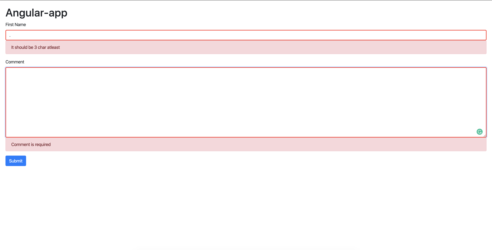

# Contact Form with Validation

This project was generated with [Angular CLI](https://github.com/angular/angular-cli) version 8.3.25.

## Development server

Navigate to the directory

Run `npm install` to install the packages.

Run `ng serve` for a dev server. Navigate to `http://localhost:4200/`. The app will automatically reload if you change any of the source files.

